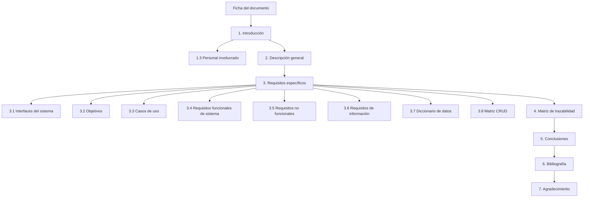
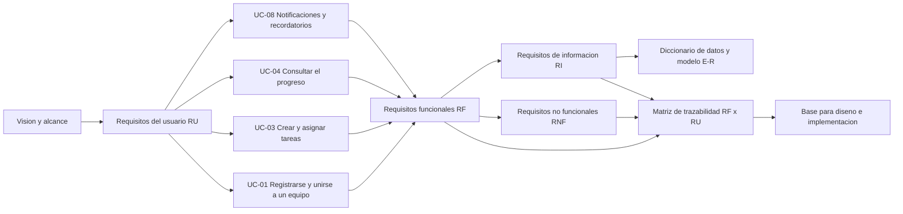

# 🧩 Especificación de Requisitos del Software (SRS)

### *NexusCampus: plataforma de colaboración académica para trabajos en equipo*

**Asignatura: Ingeniería de Requisitos · Actividad Laboratorio No. 2: Documentación de Requisitos (SRS)**

**[Contexto](#-contexto-y-alcance) • [Contenido](#-contenido-del-repositorio) • [Herramientas](#-herramientas-utilizadas) • [Estructura](#-estructura-del-documento) • [Casos de uso](#-casos-de-uso-especificados) • [Autor](#-autor)**

---

## 📋 Tabla de Contenidos

- [🎯 Contexto y Alcance](#-contexto-y-alcance)
- [📁 Contenido del Repositorio](#-contenido-del-repositorio)
- [🧰 Herramientas Utilizadas](#-herramientas-utilizadas)
- [📐 Estructura del Documento](#-estructura-del-documento)
- [🔁 Flujo de Derivación de Requisitos](#-flujo-de-derivación-de-requisitos)
- [🎬 Casos de Uso Especificados](#-casos-de-uso-especificados)
- [📚 Técnicas y Estándares Aplicados](#-técnicas-y-estándares-aplicados)
- [📄 Cómo Consultar el Documento](#-cómo-consultar-el-documento)
- [✅ Contenido Verificable del Documento](#-contenido-verificable-del-documento)
- [📝 Nota](#-nota)
- [👥 Autor](#-autor)

---

## 🎯 Contexto y Alcance

Este repositorio contiene el documento de la **Actividad Laboratorio No. 2: Documentación de Requisitos**, desarrollado en el marco de la asignatura **Ingeniería de Requisitos**.

El trabajo presenta una **Especificación de Requisitos del Software (SRS)** del producto **NexusCampus**, una plataforma de colaboración académica para la gestión de trabajos en equipo universitarios. El documento sigue el estándar **IEEE 830-1998**, emplea la sintaxis **EARS** para redactar los requisitos y las plantillas de fichas de **Durán (2000)**.

> **Estándar:** IEEE 830-1998.
> **Producto:** NexusCampus (colaboración académica).
> **Alcance:** subsistema de acceso a equipos, gestión de tareas, seguimiento y notificaciones, a partir de cuatro casos de uso.

### 🌟 ¿Qué aporta este documento?

- 🎯 **SRS acotado** a los casos de uso UC-01, UC-03, UC-04 y UC-08, que cubren el ciclo completo del producto.
- 🧾 **Fichas de requisitos** con Importancia, Urgencia, Estado, Estabilidad y Riesgo.
- 🗂️ **Diccionario de datos** estilo Wiegers, modelo de entidades y matriz CRUD.
- 🔗 **Matriz de trazabilidad** entre requisitos funcionales y requisitos del usuario, sin necesidades huérfanas.

---

## 📁 Contenido del Repositorio

<table align="center">
  <tr><th>Elemento</th><th>Descripción</th></tr>
  <tr><td><code>Desarrollo_Proyecto_Alejandro_De_Mendoza_Tovar.pdf</code></td><td>📘 Documento SRS completo: ficha del documento, introducción con personal involucrado, descripción general, requisitos específicos, diccionario de datos, matriz CRUD y matriz de trazabilidad</td></tr>
  <tr><td><code>README.md</code></td><td>📄 Este documento</td></tr>
  <tr><td><code>LICENSE</code></td><td>⚖️ Licencia MIT</td></tr>
  <tr><td><code>.gitignore</code></td><td>🚫 Mantiene en local los documentos editables (<code>.docx</code>, <code>.doc</code>) y los archivos temporales de Word</td></tr>
</table>

> ℹ️ El repositorio versiona **únicamente el PDF final**. Los enunciados, las versiones editables en Word (`.docx`) y cualquier material de trabajo quedan excluidos vía `.gitignore` y permanecen solo en local.

---

## 🧰 Herramientas Utilizadas

| Componente | Uso |
|:---|:---|
| **IEEE 830-1998** | Estructura y contenidos del documento SRS |
| **Sintaxis EARS** | Redacción no ambigua de los requisitos funcionales |
| **Plantillas de Durán (2000)** | Fichas de objetivos, casos de uso y requisitos |
| **Notación de Wiegers** | Diccionario de datos con composición y tipos |
| **Microsoft Word** | Redacción y maquetación del documento |
| **Mermaid** | Diagramas de estructura y de derivación de este README |

---

## 📐 Estructura del Documento

---

## 🔁 Flujo de Derivación de Requisitos

---

## 🎬 Casos de Uso Especificados

| Caso de uso | Descripción |
|:---|:---|
| **UC-01: Registrarse y unirse a un equipo** | Registro con correo institucional e incorporación a un equipo mediante código de invitación |
| **UC-03: Crear y asignar tareas del equipo** | Creación de tareas con responsable y plazo, con notificación inmediata al miembro asignado por chat y push |
| **UC-04: Consultar el progreso de las tareas** | Tablero con el estado de las tareas del equipo, con filtros y actualización en tiempo real |
| **UC-08: Recibir notificaciones y recordatorios** | Recordatorios automáticos push antes del vencimiento de las tareas pendientes, con antelación configurable |

---

## 📚 Técnicas y Estándares Aplicados

| Elemento | Aplicación |
|:---|:---|
| **IEEE 830-1998** | Estructura general del SRS |
| **EARS** | Patrones ubicuo, evento, estado y comportamiento no deseado |
| **Fichas de Durán (2000)** | Objetivos, Requisitos asociados, Importancia, Urgencia, Estado, Estabilidad, Riesgo |
| **Diccionario de Wiegers** | Composición con `+`, opcionales `()` y grupos `mín:máx{}` |
| **Matriz CRUD** | Relación casos de uso × entidades de datos |
| **Matriz de trazabilidad** | Relación requisitos funcionales × requisitos del usuario |

---

## 📄 Cómo Consultar el Documento

1. Descargar o abrir `Desarrollo_Proyecto_Alejandro_De_Mendoza_Tovar.pdf` desde este repositorio.
2. Seguir la estructura descrita en [📐 Estructura del Documento](#-estructura-del-documento): de la introducción a la matriz de trazabilidad.
3. Revisar las **fichas de requisitos** (sección 3) para ver la especificación individual con sus atributos.
4. Consultar el **diccionario de datos y la matriz CRUD** (3.7 y 3.8) y la **matriz de trazabilidad** (sección 4).

---

## ✅ Contenido Verificable del Documento

<b>🔎 Ver elementos que incluye el PDF</b>

| Elemento | Sección | Incluido |
|:---|:---|:---:|
| Ficha del documento | Portada | ✔ |
| Introducción y alcance | 1 | ✔ |
| Personal involucrado | 1.3 | ✔ |
| Descripción general del producto | 2 | ✔ |
| Interfaces del sistema | 3.1 | ✔ |
| Objetivos y casos de uso | 3.2 y 3.3 | ✔ |
| Requisitos funcionales (EARS) | 3.4 | ✔ |
| Requisitos no funcionales | 3.5 | ✔ |
| Requisitos de información | 3.6 | ✔ |
| Diccionario de datos y modelo E-R | 3.7 | ✔ |
| Matriz CRUD | 3.8 | ✔ |
| Matriz de trazabilidad | 4 | ✔ |
| Conclusiones | 5 | ✔ |
| Bibliografía | 6 | ✔ |
| Agradecimiento | 7 | ✔ |

---

## 📝 Nota

Este documento corresponde a una **actividad académica**. La especificación se apoya en una elicitación simulada con fines formativos y no constituye un levantamiento de requisitos con usuarios reales ya ejecutado.

---

## 👥 Autor

Trabajo desarrollado en el marco de la asignatura **Ingeniería de Requisitos**.

| Autor | Perfil |
|:---:|:---:|
| **Alejandro De Mendoza** |  |

---

### 🧩 *Un buen sistema empieza por requisitos claros, verificables y trazables*

**Ingeniería de Requisitos · Actividad Laboratorio No. 2 · Especificación de Requisitos del Software (SRS)**

